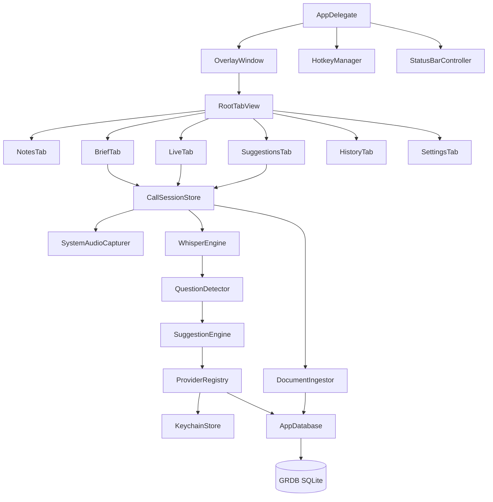

# Overlay-Opus

Invisible macOS overlay for live-call notes and AI assistance. The window is visible on the physical display but excluded from standard software capture paths.

## Core Capture Rule

`OverlayWindow` sets `NSWindow.sharingType = .none`. That keeps the overlay out of `CGWindowList`, ScreenCaptureKit, QuickTime screen recordings, OBS, Zoom/Meet/Teams share previews, and `screencapture`.

This does not protect against a phone camera, hardware HDMI capture, or accessibility/screen-reader extraction.

## Architecture



## Build

```bash
xcodebuild -project OverlayOpus.xcodeproj -scheme OverlayOpus \
  -configuration Debug -derivedDataPath /tmp/overlay-opus-build build
```

The target is `OverlayOpus`, bundle id `com.pariksj.overlay-opus`, macOS 14.0+, sandbox off, hardened runtime on, ad-hoc signed.

## Tabs

- Notes: existing autosaved notes with markdown render toggle.
- Brief: call title, brief text, provider/model selection, file drop zone, start call.
- Live: recording controls, elapsed timer, transcript stream.
- Suggestions: auto/manual/hotkey suggestions with copy/regenerate.
- History: FTS-backed search over transcripts and documents.
- Settings: provider config, whisper model download, focus mode, hotkeys, permissions.

## Providers

Provider configs are stored in `provider_config`; secrets are stored in Keychain with account names like `provider:<id>:apiKey`.

Azure OpenAI:
- Endpoint format: `https://<resource>.openai.azure.com`
- Deployment name: Azure deployment id, not base model name.
- API version: defaults to `2024-02-15-preview`.

OpenAI:
- Base URL defaults to `https://api.openai.com/v1`.
- Uses `/chat/completions` streaming SSE.

Ollama:
- Base URL defaults to `http://localhost:11434`.
- Install hint: `brew install ollama`, then `ollama pull llama3.1` or another local chat model.
- Uses `/api/chat` newline-delimited JSON streaming.

AWS Bedrock:
- Region plus access key id, secret access key, optional session token.
- IAM permission needed: `bedrock:InvokeModelWithResponseStream`.
- The SigV4 signer is local and uses CryptoKit. The current Bedrock response-stream parser is intentionally minimal and returns a clear unsupported error until binary eventstream parsing is filled in.

## Speech

STT is local-only by design. `WhisperModelManager` downloads ggml models into:

`~/Library/Application Support/Overlay/models/`

The default download target is `ggml-base.en.bin` from the upstream whisper.cpp Hugging Face mirror.

Important current caveat: the official `ggerganov/whisper.cpp` repository did not resolve as an SPM package in this environment because Xcode could not find a root `Package.swift`. The app ships a local `WhisperEngine` scaffold and model manager, ready for a future upstream xcframework/binary target drop-in. No cloud STT path was added.

## Data Locations

- Notes: `~/Library/Application Support/Overlay/notes.txt`
- SQLite: `~/Library/Application Support/Overlay/db.sqlite`
- Whisper models: `~/Library/Application Support/Overlay/models/`
- Secrets: macOS Keychain service `OverlayOpus`

## Hotkeys

| Shortcut | Action |
|---|---|
| `⌘⇧\` | Show/hide overlay |
| `⌘⇧=` / `⌘⇧-` | Increase/decrease notes font |
| `⌘⇧]` / `⌘⇧[` | Increase/decrease opacity |
| `⌘⇧L` | Cycle focus mode |
| `⌘⇧M` | Toggle notes markdown rendering |
| `⌘⇧R` | Start/stop recording |
| `⌘⇧A` | Focus manual ask in Suggestions |
| `⌘⇧Q` | Regenerate last suggestion |
| `⌘⇧T` | Jump to Suggestions |
| `⌘⇧B` | Jump to Brief |

## Permissions

Carbon hotkeys do not require Accessibility.

ScreenCaptureKit audio capture uses Screen Recording permission. Grant it in:

System Settings → Privacy & Security → Screen & System Audio Recording

The Settings tab includes a deep link to the privacy pane.

`NSMicrophoneUsageDescription` is present for future optional mic capture, but mic capture is not implemented in this scaffold.

## Test Invisibility

```bash
screencapture -x /tmp/overlay-test.png
open -a "QuickTime Player"
```

The overlay should be visible on the physical display but absent from the screenshot/recording/share preview.
